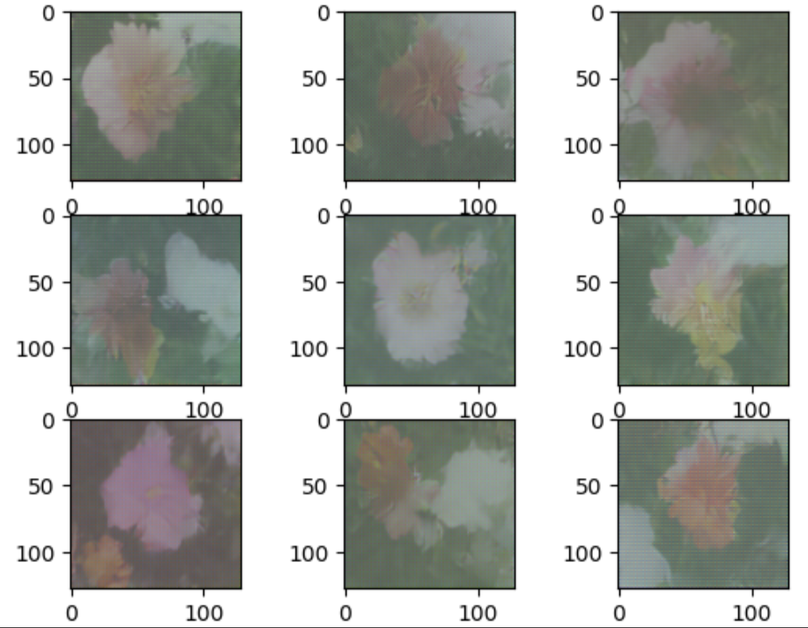
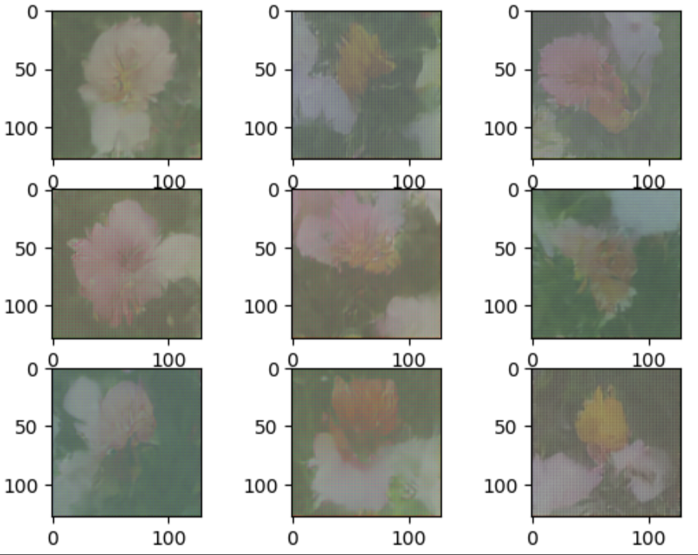

# Flower Image Generation Using Diffusion Models

This repository contains the implementation of a **diffusion-based generative model** for generating high-quality flower images using the **Oxford Flower Dataset**. The model leverages a **U-Net architecture** and **diffusion models** for the generation of 128x128 pixel flower images, trained for 2000 epochs. The project demonstrates the effectiveness of **diffusion models** in generating high-resolution images with diverse textures and fine details.

## Overview

In this project, I explore the generation of flower images using diffusion models. These models progressively refine images through iterative denoising, achieving impressive results in generating realistic and detailed flower images. The U-Net architecture has been chosen for its efficiency in capturing fine-grained details, making it ideal for image generation tasks.

### Key Contributions:
- **Diffusion-based Image Generation**: Generates high-resolution flower images using a U-Net-based architecture.
- **Oxford Flower Dataset**: The model is trained using the **Oxford Flower Dataset**, containing 8,189 images of flowers across 102 categories.
- **Optimized Training Pipeline**: Utilizes cosine learning rate scheduling, Adam optimizer, and noise variance scheduling for stable and efficient training.
- **Performance Metrics**: Evaluation of the model using FID (Fréchet Inception Distance) and PSNR (Peak Signal-to-Noise Ratio).
- **References**: [Google Colab Notebook](https://colab.research.google.com/github/huggingface/notebooks/blob/main/examples/annotated_diffusion.ipynb)
## Installation

### Prerequisites:
- Python 3.x
- PyTorch
- Kaggle (for GPU utilization)
- Required Python libraries:  
  `torch`, `torchvision`, `numpy`, `matplotlib`, `pandas`, `openCV`

```bash
pip install -r requirements.txt
```

### Cloning the Repository:
```bash
git clone https://github.com/RajeshAndra/Flower-Image-Generation-Using-Diffusion.git
cd Flower-Image-Generation-Using-Diffusion
```

## Dataset

The model is trained on the **Oxford Flower Dataset**, which contains over 8,000 flower images categorized into 102 classes. You can download the dataset from the official website:  
[Oxford Flower Dataset](https://www.robots.ox.ac.uk/~vgg/data/flowers/)

## Model Architecture

The diffusion model utilizes a **U-Net architecture** designed for image generation tasks. Key components of the architecture include:
- **Encoder**: Convolutional layers to downsample images and capture hierarchical features.
- **Decoder**: Upsampling layers to reconstruct the image and preserve spatial information through **skip connections**.
- **Positional Embeddings**: Used to encode time steps for the diffusion process.

### Diffusion Process:
The model implements a **two-step process**:
1. **Forward Diffusion**: Gaussian noise is progressively added over multiple timesteps.
2. **Reverse Diffusion**: The model denoises the image iteratively to recover the original image distribution.

## Training

### Training Details:
- **Epochs**: 2000
- **Batch Size**: 128
- **Image Resolution**: 128x128
- **Optimizer**: Adam (β1=0.9, β2=0.999)
- **Learning Rate**: 1e-4 (Cosine Annealing)
- **Noise Schedule**: Cosine annealing for better stability and image quality

## Evaluation

The model's performance is evaluated using two key metrics:
1. **FID (Fréchet Inception Distance)**: Measures the similarity between generated and real images.
2. **PSNR (Peak Signal-to-Noise Ratio)**: Assesses the quality of generated images based on pixel-wise error.

Results are recorded as follows:
- **FID Score**: 320.4
- **PSNR**: 7.03 dB

## Results

The trained model successfully generates realistic and diverse flower images, exhibiting fine details such as:
- Petal shapes
- Texture details
- Color gradients

## Future Work

- **Higher Resolution Generation**: Increase the image resolution to 256x256 or 512x512 for more detailed outputs.
- **Generative Diversity**: Further training and refinement to increase diversity and reduce image similarity.
- **Optimization**: Enhance training efficiency to reduce computational cost and improve resolution quality.

## Sample Images

<div style="text-align: center;">




</div>
